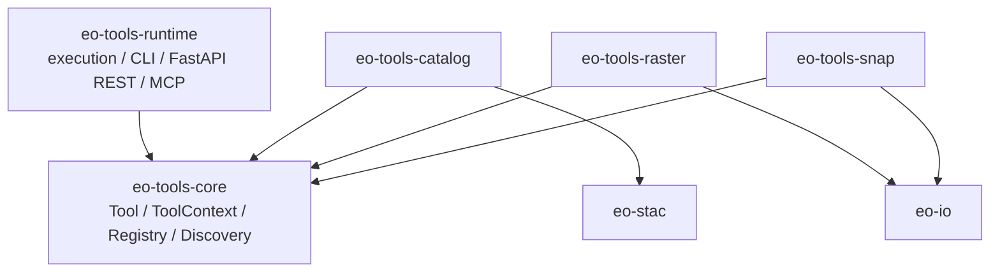

# eo-tools

Mono repo for Earth Observation Tools.

## 1. 设计概要

### 1.1 工程边界

eo-tools工程内边界

    eo-tools-core     # Tool contract
      最小 Tool 协议层
      无 FastAPI / MCP / web runtime 依赖
     
    eo-tools-runtime  # CLI / REST / MCP runtime
      Tool hosting / serving 层
      依赖 eo-tools-core
      包含 execution、REST、MCP、CLI smoke entrypoint
    
    eo-tools-*        # Concrete tool plugins
      eo-tools-catalog
      eo-tools-raster
      eo-tools-snap
      
      具体工具插件层
      依赖 eo-tools-core
      彼此不依赖

eo-tools工程外相关工程

    eo-libs    # EO reusable libraries
      eo-io
      eo-stac
      eo-store


### 1.2 工程依赖关系


依赖方向说明：

    eo-tools-catalog/raster/snap -> eo-tools-core
    eo-tools-catalog/raster/snap -> eo-io / eo-stac / eo-store as needed
    
    eo-io / eo-stac / eo-store -X-> eo-tools-core/runtime/tools

### 1.3 Tool 插件工程约定

每个工具包都应该是独立插件：

    eo-tools-catalog
      depends: eo-tools-core, eo-stac, pystac..., shapely...
      entry point: geosprite.eo.tools = catalog -> geosprite.eo.tools.catalog
    
    eo-tools-raster
      depends: eo-tools-core, eo-store, eo-io, GDAL...
      entry point: geosprite.eo.tools = raster -> geosprite.eo.tools.raster
    
    eo-tools-snap
      depends: eo-tools-core, eo-store, SNAP runtime...
      entry point: geosprite.eo.tools = snap -> geosprite.eo.tools.snap

例如：catalog 和 raster 不互相 import。需要共享的数据结构、STAC DTO、I/O helper，放到 libs/stac、libs/io。

## 2. 设计方案

### 2.1 eo-tools-core工程
#### 1）保持极简：

    kernel/src/geosprite/eo/tools/
      tool.py          # Tool 抽象类
      context.py       # ToolContext Protocol
      registry.py      # ToolRegistry
      discovery.py     # package-local decorator / discovery / registry assembly
      __init__.py

#### 2）Tool 插件体系的底座：

#### Writing a tool

```python
from pydantic import BaseModel
from geosprite.eo.tools import Tool, ToolContext


class HelloIn(BaseModel):
    name: str = "World"


class HelloOut(BaseModel):
    greeting: str


class HelloTool(Tool[HelloIn, HelloOut]):
    name = "demo.hello"
    version = "0.1.0"
    domain = "demo"
    summary = "Echo a friendly greeting."
    description = "Returns 'Hello, <name>!'. Useful as a smoke test."
    InputModel = HelloIn
    OutputModel = HelloOut

    async def run(self, ctx: ToolContext, inputs: HelloIn) -> HelloOut:
        return HelloOut(greeting=f"Hello, {inputs.name}!")
```

#### Registering a tool

Tool packages use the shared decorator from `eo-tools-core`:

```python
from geosprite.eo.tools import tool, Tool


@tool
class HelloTool(Tool[HelloIn, HelloOut]):
    ...
```

#### 3）Tool 插件自动发现机制：
At startup a host discovers installed tool plugin packages from Python entry
points, then builds one registry from package-scoped tool discovery:

```python
from geosprite.eo.tools import build_registry_from_entry_points

registry = build_registry_from_entry_points()
```

### 2.2 eo-tools-runtime工程

#### 2.2.1 设计背景：

    CLI 本地运行
    REST Web Service
    MCP Server
    未来 batch / workflow / queue / daemon

#### 2.2.2 依赖关系：

CLI, REST 和 MCP 之间不应该互相依赖。它们应该是 sibling adapters：

    eo-tools-runtime
      execution.py          # 共享：校验输入、调用 Tool.run、序列化输出、生成 descriptor
      context.py            # 共享：LocalToolContext / context factory
      rest.py               # FastAPI adapter，依赖 execution
      mcp.py                # MCP adapter，依赖 execution
 也就是说

    rest.py --> execution.py --> eo-tools-core
    mcp.py  --> execution.py --> eo-tools-core
    
    rest.py -X-> mcp.py
    mcp.py  -X-> rest.py

#### 2.2.3 组织结构：

    runtime/src/geosprite/eo/tools/runtime/
      core/
        execution.py
        context.py
        loader.py
    
      adapters/
        cli.py
        rest.py
        mcp.py

#### 2.2.4 Adapters设计形态：

#### 1）CLI：

CLI 应该是一个通用 Tool runner，而不是每个插件自己写一套命令。 建议命令形态：

    eo-tools list
    eo-tools list --tool-package geosprite.eo.tools.catalog
    
    eo-tools describe catalog.get_grs_systems
    
    eo-tools run catalog.get_grs_systems \
      --json '{}'
    
    eo-tools run catalog.get_grs_tiles \
      --json '{"system":"mgrs","geojson":"..."}'

#### 2）REST：
    eo-tools serve-rest \
      --tool-package geosprite.eo.tools.catalog \
      --tool-package geosprite.eo.tools.raster \
      --port 8000

#### 3）MCP：    
    eo-tools serve-mcp \
      --tool-package geosprite.eo.tools.catalog \
      --tool-package geosprite.eo.tools.raster \
      --port 9000


#### 2.2.5 基于Adapters的Tool 插件暴露：

The runtime project exposes any `ToolRegistry` through CLI, FastAPI REST, or
MCP. Install only what a host needs:

```bash
pip install -e runtime
pip install -e "eo-tools-runtime[rest]"
pip install -e "eo-tools-runtime[mcp]"
```

eo-tools-runtime 可以这样分 extras 进行依赖设计：

    [project.optional-dependencies]
    cli = [
      "typer>=0.12",
      "rich>=13",
    ]
    rest = [
      "fastapi>=0.115",
      "uvicorn[standard]>=0.30",
    ]
    mcp = [
      "mcp>=1.10",
    ]
    all = [
      "typer>=0.12",
      "rich>=13",
      "fastapi>=0.115",
      "uvicorn[standard]>=0.30",
      "mcp>=1.10",
    ]

    [project.scripts]
    eo-tools = "geosprite.eo.tools.runtime.cli:main"
